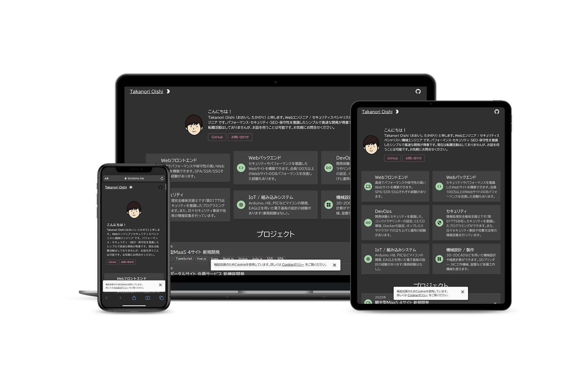

# Oishi Takanori ポートフォリオ & ブログ 💚


[](https://app.fossa.com/projects/git%2Bgithub.com%2Fbicstone%2Fportfolio?ref=badge_shield)
[](https://sonarcloud.io/dashboard?id=bicstone_masshiro.me)
[](https://lgtm.com/projects/g/bicstone/masshiro.me/alerts/)
[](https://deepsource.io/gh/bicstone/portfolio/?ref=repository-badge)

2020 年に作成したポートフォリオサイトです。  
2022 年には、ブログ機能を追加しました。



## 構成

Gatsby.js + Contentful + Amazon CloudFront (Cloud Functions) + Amazon S3 を用いた Jamstack 構成としました。

※ ステージング環境は Gatsby Cloud を使用

## 特徴

### パフォーマンス

- SSG で構築しており、ビルド後の資産は完全に静的であるため、高速で応答します。
- インフラには、Amazon CloudFront + Amazon S3 を用いており、ユーザーの最寄りデータセンターから転送されるため通信が安定します。
- Cache-Control HTTP ヘッダーを適切に設定しており、2 回目以降に余分なダウンロードを防止したり、逆に古いコンテンツが表示されることを防ぎます。
- Lighthouse のベンチマークでスコア 100/100 を達成しています。

### セキュリティ

- SSG で構築しており、ビルド後の資産は完全に静的であるため、脆弱性による改ざん等のリスクが軽減されます。
- DNSSEC を構成しており、DNS キャッシュ ポイズニング攻撃や DNS スプーフィングなどのリスクが軽減されます。
- セキュリティを強化する HTTP ヘッダを設定しています。 (ただし広告配信のため CSP は最小限度の設定)
- 利用可能な暗号スイートを TLSv1.3 と TLSv1.2 に限定し、2022 年現在判明している脆弱なプロトコルをブロックしています。
- Mozilla Observatory のベンチマークでスコア 105/100 を達成しています。
- DeepSource, SonarCloud, LGTM を使用し、静的セキュリティレビューを受けています。
- 二要素認証を用いたアカウント保護を行っています。 GitHub 上で承認を行わないと deploy できないようにしています。
- Renovate を用いて依存関係を定期的にアップデートしています。

### アクセシビリティ

- 文字と背景とのコントラスト比は 4.5:1 を超えるように設定しています。
- ダークモードでは、彩度を下げて目に負担がかからないようにしています。
- キーボードのみで操作できるように設計しています。
- テキストブラウザや音声ブラウザで使用できるよう、セマンティクスなマークアップで実装しています。
- 代替テキストや、必要に応じて WAI-ARIA を設定しています。
- axe 及び Lighthouse で静的アクセシビリティレビューを受けています。

### DevOps

- CI/CD や SaaS を使用することで、開発効率を高めつつ、継続的な自動化と品質保持を行っています。
- Amazon CloudWatch による監視を行っています。
- FOSSA を用いることで、ライブラリ追加時のライセンス管理を行っています。
- Sentry を用いてエラー管理を行っています。
- ポートフォリオは最新のコンテンツを維持し続けることが最も重要であるため、更新作業を省力化することが最も重要だと考えました。バックエンドはヘッドレス CMS である Contentful で管理しています。

## 使用技術

### 言語 / FW

- TypeScript (strict モード)
- React.js
- Gatsby.js (プラグインを活用し高速に構築ができるため選定)
- Material-UI (一覧性の高いダッシュボード風のデザインにするため選定)
- Emotion
- MDX
- Prism.js
- i18next

### ツール

- Webpack
- Babel
- esbuild
- ESLint
- prettier (フォーマットを自動化することで省力化)
- graphql-code-generator (型を自動生成することで省力化)
- barrelsby (ES modules 管理の省力化)

### CI / CD ツール

- husky (開発環境での CI)
- GitHub Actions (CI / CD)
- Gatsby Cloud (ステージング環境の CD)
- SonarCloud (静的レビュー)
- LGTM (静的レビュー)
- DeepSource (静的レビュー)
- FOSSA (ライセンスの管理)
- Semantic Pull Request (コミットメッセージの整形)
- Renovate (ライブラリ管理)

### その他

- Google Tag Manager
- Google Analytics
- Google AdSense

## タスクランナー

### 開発サーバーを立ち上げ

```shell
yarn develop
(...or)
yarn dev
(...or)
yarn start
```

### プロダクションビルド

```shell
yarn build
```

### プロダクションとしてサーバーを立ち上げ

```shell
yarn build
yarn serve
```

### キャッシュのクリア

```shell
yarn clean
```

### リンターによる静的解析

```shell
yarn lint
```

### リンターによる静的解析(自動修正モード)

```shell
yarn lint:fix
```

### TypeScript による型検証

```shell
yarn typecheck
(...or)
yarn tc
```

### 翻訳 JSON を更新

```shell
yarn extract
(...or)
yarn t
```

### GraphQL の型情報を取り込む

```shell
yarn graphql-codegen
(...or)
yarn g
```

### barrelsby によるバレル(index.ts)の生成・更新

```shell
yarn barrelsby
(...or)
yarn b
```

### amazon s3 への deploy

```shell
yarn deploy
```

## 動作対象ブラウザ

package.json の browserslist を参照

## ライセンス

MIT Licence

[](https://app.fossa.com/projects/git%2Bgithub.com%2Fbicstone%2Fportfolio?ref=badge_large)
