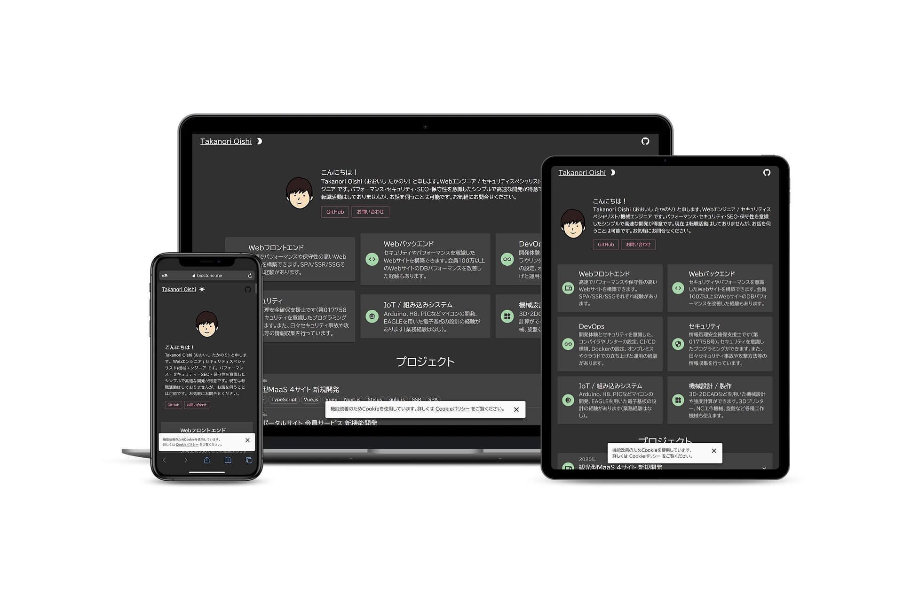

# Oishi Takanori (@bicstone) ポートフォリオ & ブログ


[](https://app.fossa.com/projects/git%2Bgithub.com%2Fbicstone%2Fportfolio?ref=badge_shield)
[](https://standardjs.com)

2020 年に作成したポートフォリオサイトです。  
~~2022 年には、ブログ機能を追加しました。~~ 2024 年に削除



## 構成

Gatsby.js + Cloudflare Workers (Static Assets) を用いた Jamstack 構成としました。

## 使用技術

### 言語 / FW

- TypeScript (strict モード)
- React.js
- Gatsby.js (プラグインを活用し高速に構築ができるため選定)
- MUI material (一覧性の高いダッシュボード風のデザインにするため選定)
- Emotion
- React Virtuoso

### ツール

- Webpack
- Babel
- ESLint
- prettier (フォーマットを自動化することで省力化)
- graphql-code-generator (型を自動生成することで省力化)

### CI / CD ツール

- husky (ローカル環境での CI)
- GitHub Actions (CI / CD)
- FOSSA (ライセンスの管理)
- Renovate (ライブラリ管理)

### その他

- Google Tag Manager
- Google Analytics
- Sentry

## タスクランナー

### ローカルサーバーを立ち上げ

```shell
pnpm run develop
```

### プロダクションビルド

```shell
pnpm run build
```

### プロダクションとしてサーバーを立ち上げ

```shell
pnpm run build
pnpm run serve
```

### キャッシュのクリア

```shell
pnpm run clean
```

### リンターによる静的解析

```shell
pnpm run lint
```

### リンターによる静的解析(自動修正モード)

```shell
pnpm run lint:fix
```

### TypeScript による型検証

```shell
pnpm run typecheck
```

### GraphQL の型情報を取り込む

```shell
pnpm run graphql
```

### Cloudflare Workers でのローカル配信

```shell
pnpm run build
pnpm run cloudflare:dev
```

### Cloudflare Workers への deploy

```shell
pnpm run cloudflare:deploy
```

## 動作対象ブラウザ

package.json の browserslist を参照

## Submodule について

`content` ディレクトリ及び `static` ディレクトリは、著作権などが複雑になるのを避けるため、非公開リポジトリで管理しています。

`content` は `content-sample` ディレクトリをコピーして作成してください。

`static` は空のディレクトリを作成してください。

## ライセンス

- ディレクトリ内に LICENSE ファイルがある場合、そのライセンスに従います。
- Git Submodule で参照しているプライベートリポジトリは [ライセンスなし(未公開)](https://choosealicense.com/no-permission/) です。
- その他は MIT License

[](https://app.fossa.com/projects/git%2Bgithub.com%2Fbicstone%2Fportfolio?ref=badge_large)
